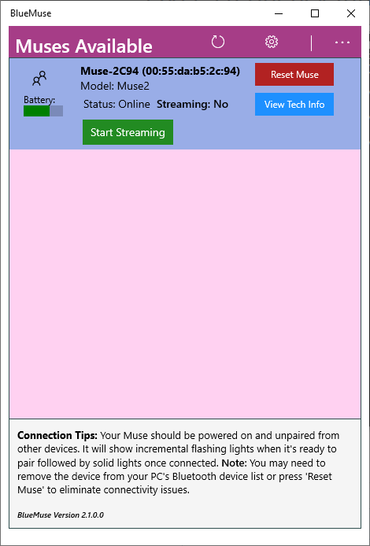
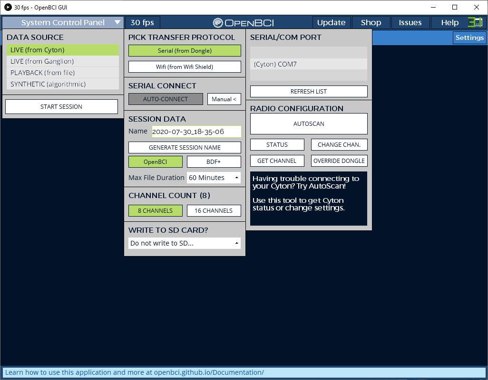

# Initiating an EEG Stream

Initiating an EEG stream is a relatively easy process using the `eegnb.devices.eeg.EEG` class which abstracts the 
the various devices and backends behind one easy call.

```python
from eegnb.devices.eeg import EEG

# define the name for the board you are using and call the EEG object
eeg = EEG(device='cyton')

# start the stream
eeg.start()
```

These two lines of code abstract a lot of the heavy lifting with respect to switching streaming backends for the various 
support devices.

## Devices

The supported devices and the parameters (both optional and required) needed for the class for each are listed below.

| Device               | EEG.device         | EEG.serial_port | EEG.serial_num | EEG.mac_addr |
|----------------------|--------------------|-----------------|----------------|--------------|
| Muse                 | 'muse2016'         | | | |
| Muse 2               | 'muse2'            | | | |
| Cyton                | 'cyton'            | *(optional; see below)* | | |
| Cyton + Daisy        | 'cyton_daisy       | *(optional; see below)* | | |
| Cyton + Daisy - WiFi | 'cyton_daisy_wifi' |  | | |
| Ganglion             | 'ganglion'         | *(optional; see below)* | | |
| Ganglion - WiFi      | 'ganglion_wifi'    | | | |


## Initiating a Muse stream in Windows using Bluemuse
To initialize the EEG stream on window you must have Bluemuse running in the background. Open a terminal and start 
bluemuse using `start bluemuse;` which should open up a GUI. If you have the USB dongle plugged in and the muse turned on 
then you should see a GUI which looks something like the image below.



Once you press the **Start Streaming** button, muse will be streaming data in the background and can the above code can 
be run to begin the notebooks interfacing with the bluemuse backend.


## Finding the USB port of the OpenBCI USB dongle
If the library is not connecting to an OpenBCI device this might be an issue of defaulting to the wrong serial 
port. If this is happening you can check the serial port of the dongle by opening the OpenBCI GUI and navigating to the 
menu pictures below.



Now that we have the COM port, we can initiate the stream by passing it to the EEG device in the object call.
```python
from eegnb.devices.eeg import EEG

# define the name for the board you are using and call the EEG object
eeg = EEG(
    device='cyton',
    serial_num='COM7'
)

# start the stream
eeg.start()
```

This issue is more common on windows installations, and the image above is shown on a windows OS. However it might still 
be possible for it to happen in Linux and in any case, the process for determining the USB port of the dongle is the same.

## Finding the MAC address of the Ganglion

(Information needed)